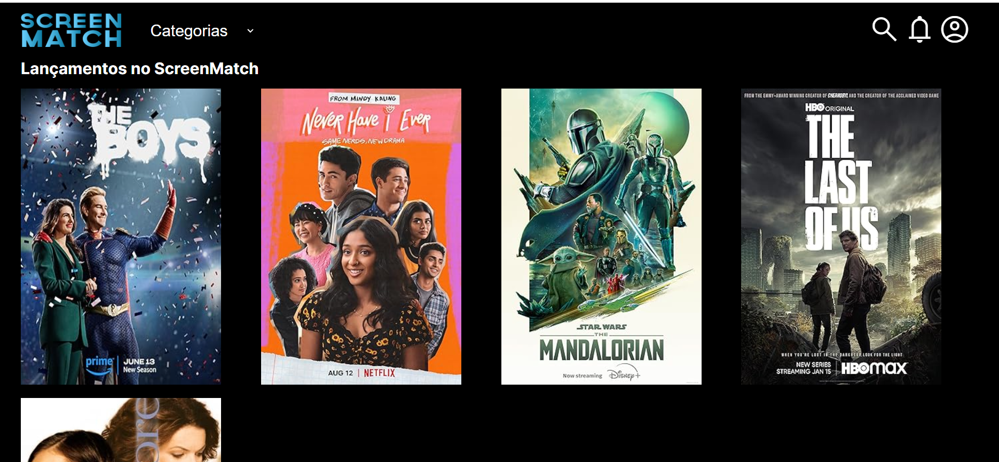

# VollMed-app

  ## 📄 Table of Contents
  
  - [Description](#description)
  - [Usage](#usage)
  - [Features](#features)
  - [Tools](#tools)
  - [License](#license)
  - [Questions](#questions)

  ## 💻 Description
  
  The ScreenMatch project is being transformed from a command-line application into a REST API. This process involves understanding the MVC architecture and using Spring annotations for route mapping to ensure efficient client-server interaction. Best practices and Data Transfer Objects (DTOs) will be implemented to maintain clean and efficient code. The API will receive movie data from the OMDB API, add it to the local database, and then transfer it to the front-end application. CORS issues will be addressed to enable secure data sharing. This integration provides a seamless fullstack experience, demonstrating the complete workflow from back-end to front-end.
  
  ## 🎨 Usage

  

  ## ⚙️ Features/Objetive

- Update the ScreenMatch project, initially created with the command line, to become a REST API;
- Understand the MVC structure in the development of Web applications;
- Create and map routes using Spring annotations;
- Use best practices and understand the concept of DTO (Data Transfer Object);
- Connect data made available by the back-end to a front-end application, available at this link
- Handle CORS errors when making data available;
- Provide a fullstack experience, demonstrating the end-to-end flow of the application.

  ## 🛠 Tools

  The following technologies were used in the development of the Rest API of the project.

- **[Java 17](https://www.oracle.com/java)**
-   
- **[Spring Boot 3](https://spring.io/projects/spring-boot)**
-  
- **[Maven](https://maven.apache.org)**
- 
- **[PosgreSQL](https://www.postgresql.org/)**
- 
- **[Hibernate](https://hibernate.org)**
- 
- **[Jackson](https://github.com/FasterXML/jackson)**
- 

  ## 📝 License

 This application is covered under the  license
  

  ## 📝 Questions

  For additional questions, please contact mateus.oliveira.uk@gmail.com. Visit my [GitHub profile](https://github.com/Mateuzuk) to see more of my work.
  
  

